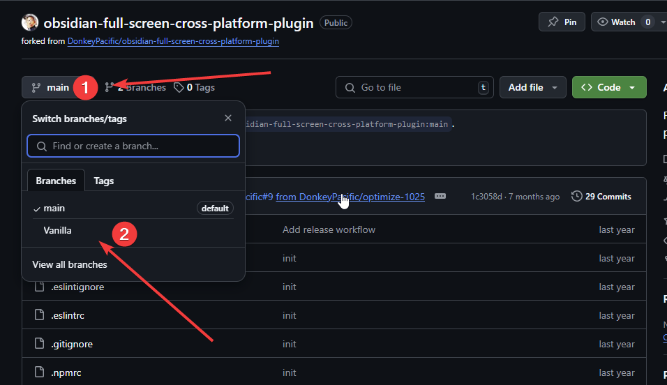
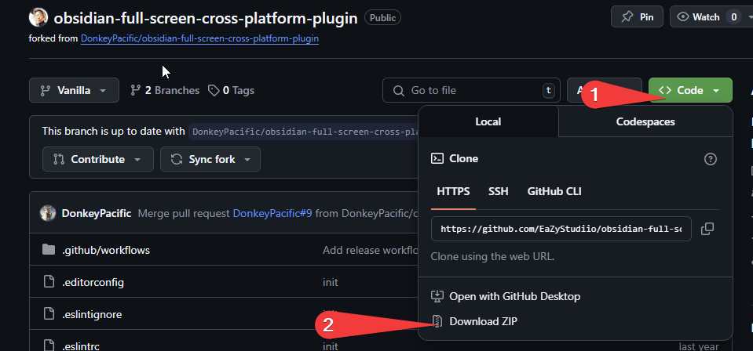

# Note
Switch Branch to Vannila and download ZIP 😥... Umm for the visual learners 

** Step 1 **

** Step 2 ** once downloaded just need to manually install the plugin that's it

----

# Fullscreen Toggle

Fullscreen focus across all platforms. It helps you get more display space when you focus on reading notes, especially on mobile devices.

**usage**

- Shortcuts: double click/touch to toggle fullscreen (or triple by settings).
- Command: Full screen (It is recommended to use the mobile end, and an example is provided below).
- Command or hotkey only:  When you feel that mouse clicks will accidentally trigger Fullscreen, you can enable using only commands and shortcut keys through settings. Special thanks for [Aleksey Rowan](https://github.com/aleksey-rowan)'s contribution.

***

**Contact me**

- email: donkeypacific@outlook.com

